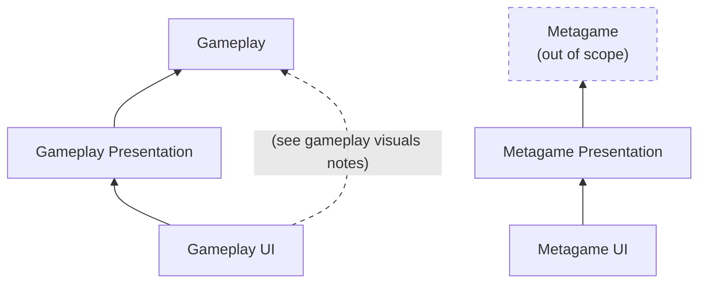

# Simple Asteroids Project

This is a simple implementation of the Asteroids game intended to illustrate programming, Unity and general code architecture skills. For a high level overview, refer to [TL;DR;](#tldr). For details about specific parts of the project, refer to their own sections.

The game works with a single `Scene` called `ApplicationScene.scene`. The entry point for the code is at the `"Bootstrap"` `GameObject`, more specifically the `Bootstrap.cs` `MonoBehaviour`. To run the game, just open the scene and hit play.

> **Important**: make sure to build Addressables if running without the Asset Database.

## TL;DR;

This project demonstrates a scalable game architecture following key principles for long-term maintainability:
* **Separation of concerns**:
    * Isolation between gameplay and metagame.
    * Isolation between UI and UnityEngine heavy-weight APIs (like MonoBehavior and Addressables) from the core of the code.
* **Resource management**: Efficient control over memory and resource usages (like not have metagame UI loaded during gameplay and vice-versa).
* **SOLID principles**: By leveraging abstraction layers and interfaces.
* **Scalability**:
    * Consistent gameplay architecture that can be scaled, tested and maintained with a data-oriented approach.
    * Feature-based project organization that makes feature development and maintanance manageable.

For further details, refer to the [Project Details](#project-details).

**Key Design Decisions & Trade-offs:**
* An interface-based design, although good for testability and maintenance, can sometimes add complexity through multiple abstractions.
* The gameplay core logic, although independent from heavy-weight Unity APIs, was not extracted to a separate `.asmdef` for simplicity.
* Some systems could be broken down further to keep responsibilities small and improve on testability
* There's no loading screen pre-loaded in the scene to avoid transition gaps between splash screen and UI.
* Assuming the simplicity of the game, UI unresponsiveness related to just-in-time loading of UI views were ignored.

## Project Details

### General Structure

The project follows a feature-based organization where each major feature contains its related code, assets, and tests:

```
Assets/
├── Application/                # Game initialization and game<->metagame flow control
│   ├── Runtime/                # Runtime source code with its own `.asmdef`
│   └── Scenes/
├── Gameplay/
│   ├── Simulation/             # Game logic and systems
│   │   ├── Prefabs/
│   │   ├── Runtime/
│   │   ├── ScriptableObjects/        
│   │   └── Tests/              # Tests source code with its own `.asmdef`
│   ├── Presentation/           # Unity integration layer
│   └── UI/                     # Gameplay UI components
├── Metagame/                   # Main Menu and metagame flow
└── Packages/
    └── com.company.utilities/  # Shared utilities
```

This structure keeps related functionality and assets together, making feature development and maintenance more atomic/manageable.

### Code Architecture

The project implements a layered architecture inspired by Clean Architecture principles. The diagram below illustrates the main components of the project and their flow of dependencies.



**Key Components:**
- **Gameplay/Metagame Layer**: Ideally pure business/game logic, independent of UI and presentation layers.
- **Presentation Layer**: Responsible for orchestrating flows and different use cases. Implements interfaces for the UI layer to implement and depends on gameplay/metagame layers.
- **UI Layer**: UI components and code with no business logic. Views have no external dependencies apart from the interface they implement and respect the [Humble Dialog](https://martinfowler.com/articles/humble-dialog-box.html) approach.
- **Application Layer**: Orchestrates initialization and metagame<->gameplay flow

Each layer has its own `Runtime` assembly definition (`.asmdef`) to enforce dependency boundaries.

#### Handling UI

The UI follows a simple Model-View-Presenter pattern:
- **Views**: Pure UI components and behavior with no business logic
- **Presenters**: Coordinates the navigation flow, handling actions and interacting with gameplay/metagame core logic API
- **Model**: Core gameplay/metagame business logic

For navigation, it leverages `Tasks` and the `IDisposable` interface to abstract resource management.

#### Gameplay Visuals

For gameplay visuals, a similar setup as for the rest of the code was done, where code for visuals were kept completely unreferenced by the simulation code. The exception here was that the presentation layer was bypassed. In practice, having this additional layer hinders development speed, and might not be worth the effort (see `ICameraGroup` and `IInputProvider` flows as two different examples).


#### Gameplay Simulation

The gameplay simulation follows a lightweight data-oriented approach of game systems and data objects. Game objects like the ship, saucers and asteroids have a main `MonoBehavior` component that exposes the "data" fields to game systems. Generally, there's one system for each kind of "feature" like asteroids, bullets, etc. Note that some concessions were made regarding single responsibility in order to limit the scope of the project.

Besides facilitating performance optimizations, this architecture usually keeps dependency trees pretty flat and allow for easy composition of functionalities, facilitating maintenance, readability and scalability.

The main challenge here was to leverage Unity's physics system without exposing it to the core logic of the gameplay. There was also the consideration of separating "visual" vs "logic" prefabs, but this can generally make content creation more complicated.

The gameplay also includes an example of lightweight unit tests for the `ShipSystem`.

The entry point for the gameplay is the `GameplayFactory` class, which loads asset dependencies, instantiate objects and create a disposable object.

Finally, the gameplay leverages object pools to minimize object instantiation during gameplay.

#### Memory Management

A simple wrapper on Addressables was implemented to abstract its complexity away from the code base.

There are two types of usage in the project:
* **Gameplay assets**: all loaded eagerly in parallel and manually disposed by a disposer object.
* **UI views**: loaded on-demand by the wrapper, and decorated by a disposable handle object that hides away the Addressables dependency.

The UI and Gameplay layers are the only ones that interact with it directly through `AssetLibrary` classes (i.e.: `GameplayAssetLibrary` and `GameplayUIAssetLibrary`).

## Appendix

### Gameplay requirements

The following requirements were identified by looking at the [Asteroids' Wikipedia page](https://en.wikipedia.org/wiki/Asteroids_(video_game)) and playing existing browser versions of the game.

* Waves:
    * Spawn instantly 4 asteroids, and increases by 1 each wave
    * They always spawn as big asteroids
    * A new wave begins once the screen has been cleared of all asteroids and actively flying saucers
    * Each wave spawns increasingly faster asteroids, starting with 1 and increasing by 1 each wave
* Asteroids:
    * Big asteroids spawn 2 medium ones once destroyed
    * Medium asteroids spawn 2 small ones once destroyed
    * Asteroids don't collide with each other
    * Smaller asteroids always spawn on the same rough direction, within a cone of 180 (?) degrees
* The player can move by
    * Rotating the ship counter and clock-wise
    * The player can thrust forward
* Bullets have a limited range so it technically can't hit its own shooter due to that
    * Saucer bullets can hit asteroids
* Player can shoot bursts of 4 bullets
    * There's a limited rate of fire
    * There's a small cooldown between bursts (reload)
* Two flying saucers appear periodically on the screen
    * The "big saucer" shoots randomly and poorly
    * The "small saucer" fires frequently at the ship
        * ~~As the player's score increases, the angle range of the shots from the small saucer diminishes until the saucer fires extremely accurately.~~ (dropped requirement to reduce scope)
    * ~~After reaching a score of 40,000, only the small saucer appears~~ (dropped requirement to reduce scope)
    * They always move from one side to the other, randomly moving up and down diagonally
    * Both can appear already in the first wave
    * They can get destroyed asteroids, breaking asteroids in the process
    * ~~Saucer bullets are slightly slower than player's~~ (dropped requirement to reduce scope)
* The player starts with 3 lives
    * Every 10k points, the player gains 1 life
* The player can teleport the ship, causing it to disappear and reappear in a random location on the screen
    * It's possible to teleport into asteroids, killing the ship
* Points are only given when:
    * A player bullet hits something
    * ~~The player itself hits something (and dies in the process)~~ (dropped requirement to reduce scope)
    * Scores are given according to the target hit:
        * Big asteroid: 20 points
        * Medium asteroid: 50 points
        * Small asteroid: 100 points
        * Big saucer: 200 points
        * Small saucer: 1000 points
